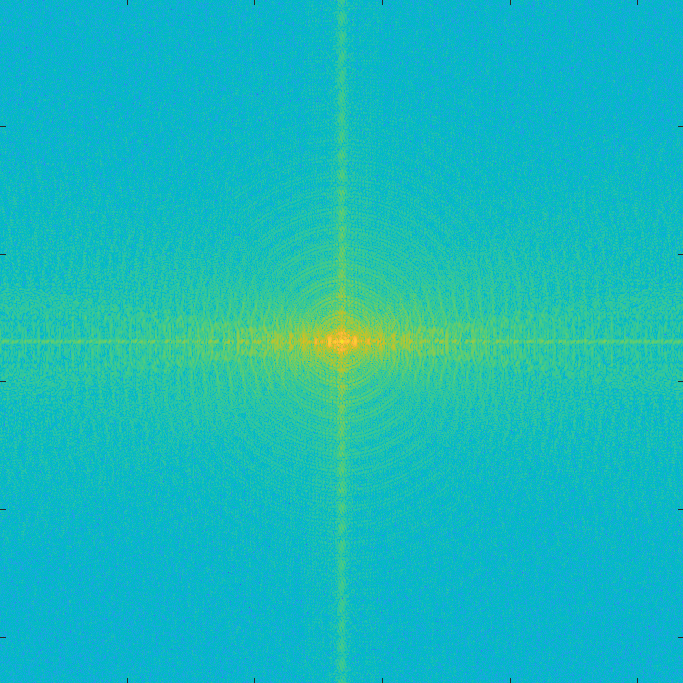

# CDI_Toolbox

This repository contains a simple Matlab demo of Coherent Diffractive Imaging (CDI) reconstruction algorithm enabling reconstructions of binary objects from far-field diffraction intensity patterns. This toolbox accompanies a thesis, submitted at FNSPE, Czech Technical University, in which more detail about the simulation aims and used models are specified.

The code uses the iterative __shrinkwrap__ phase retrieval technique, which was implemented based on work by Marchesini ([X-ray image reconstruction from a diffraction pattern alone](https://journals.aps.org/prb/abstract/10.1103/PhysRevB.68.140101))  and Fienup ([Phase retrieval algorithms: a comparison](https://doi.org/10.1364/AO.21.002758), [Reconstruction of an object from the modulus of its fourier transform](https://opg.optica.org/ol/abstract.cfm?uri=ol-3-1-27)).

Function `model_intensity_pattern.m` calculates the far-field diffraction pattern of a given object, enabling reduction of dynamic range of the pattern and noise introduction.  
The script `CDI_simulation_demo.m` performs the shrinkwrap reconstruction of the object from the simulated intensity pattern. 

    &nbsp;   
_The demo intesity (left) and reconstructed pattern (right)._
